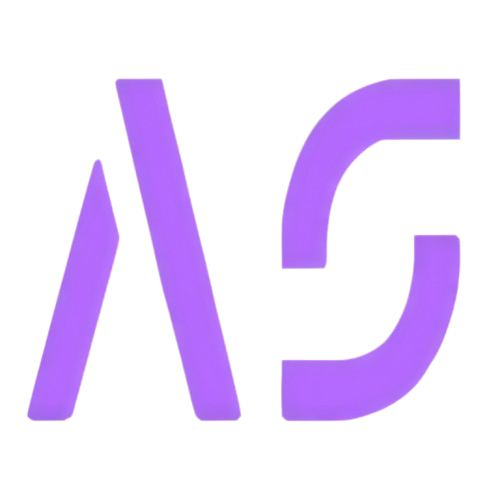

<p align="center">
  
</p>

# HEY THERE 👋

This is my personal portfolio website. The application is built with **Next js / React / MDX** and friends.

## Installation

```bash

git clone https://github.com/Anurag-singh-RBU/anuragsingh.dev.git

cd anuragsingh.dev

yarn

yarn dev

```

or use NPM

```bash

git clone https://github.com/Anurag-singh-RBU/anuragsingh.dev.git

cd anuragsingh.dev

npm install

npm run dev

```

### Running locally

To run the project locally , create a `.env.local` file and add the required API credentials there.

## Built Using

- [Next.js](https://nextjs.org)
- [Tailwindcss](https://tailwindcss.com)
- [MDX](https://github.com/mdx-js/mdx)
- [Vercel](https://vercel.com)
- [Firebase](https://firebase.google.com/)
- [Prisma](https://www.prisma.io/)
- [Supabase](https://supabase.com/)
- [Next Auth](https://next-auth.js.org/)
